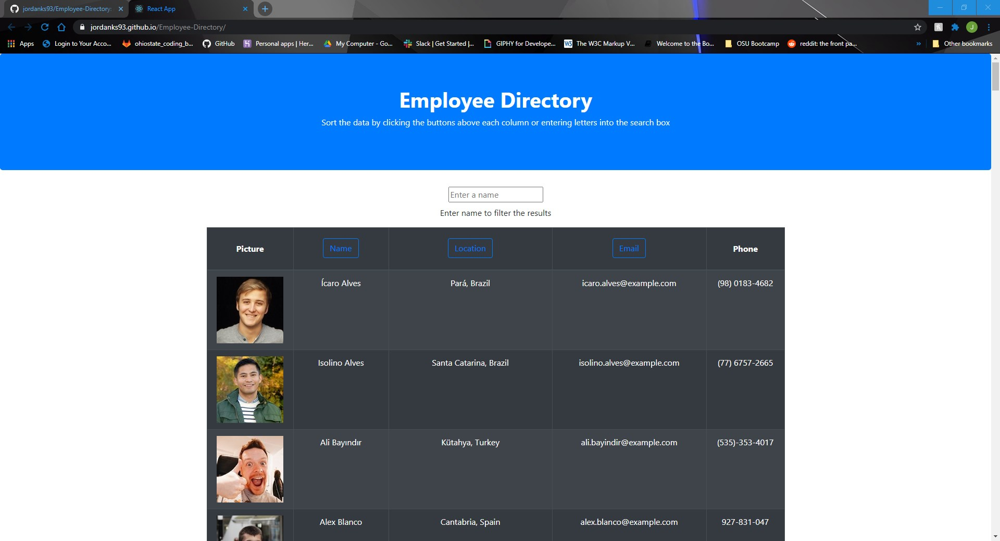

# Employee Directory

  ## Description
  An employee directory app that will sort and filter employees by name, location and email depending on the users input.
  
  [GH Pages Link](https://jordanks93.github.io/Employee-Directory/)

  

  ## Table of Contents
  * [Installation](#installation)
  * [Credits](#credits)
  * [Contributions](#contributions)
  * [Questions](#questions)
  * [License](#license)
   
  ## Installation
  ### Requires
  * Node

  1. Clone the repo from github 
  2. Pull up the project in your file directory 
  3. Type "npm i" into the terminal to install the required modules 
  4. Type "npm start" to run the program 

  ## Credits
  Jordan Stuckman
  ## Contributions
  Contact me by email or just submit a pull request.
  ## Questions
  If you have any questions or feedback, contact me at jordanks93@gmail.com.
  My github profile is jordanks93.
  ## License
  MIT

